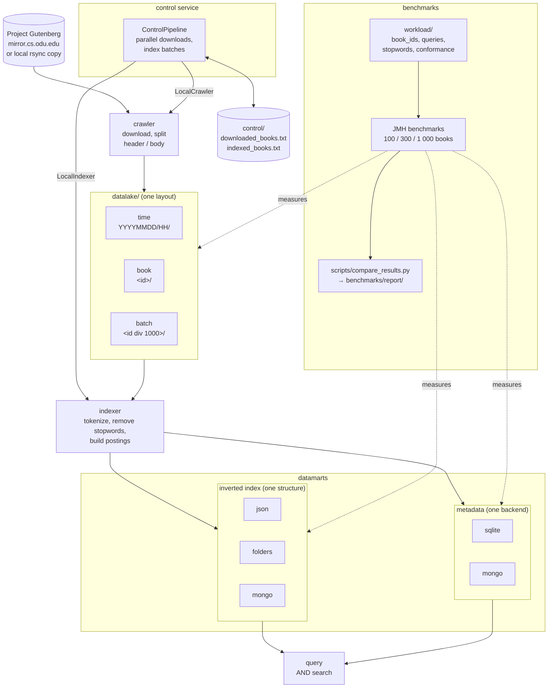

# Query Tarantino — Stage 1: Data Layer (Java)

Java implementation of the data layer of a search engine over [Project Gutenberg](https://www.gutenberg.org/) books:
a **datalake** with the raw texts, **datamarts** with metadata and an inverted index, and a minimal **control layer**
that coordinates downloading and indexing.

The behavior shared with the Python and C++ implementations (split rules, datalake layouts, tokenizer,
datamart formats, control algorithm, benchmark format, command-line interface, code layout and tests) is
defined in [SPEC.md](SPEC.md). This implementation is the reference: the SPEC gives the Python and C++
equivalent of each choice it makes (SPEC §14).

## Architecture



The control service drives the crawler and indexer in process (it depends on their jars); each service can
also be run on its own. The datalake layout, index structure and metadata backend are chosen through
[Configuration](#configuration), and the benchmarks compare the alternatives of each one.

## Data structure comparisons

The project implements several interchangeable structures for each part of the data layer and benchmarks
them against each other with the same books, the same rules and in three languages (Java, Python, C++):

**1. Datalake: how downloaded books are organized** (PDF §3.1)

| Structure | Layout                                            | Trade-off                                                   |
|-----------|---------------------------------------------------|-------------------------------------------------------------|
| `time`    | `datalake/YYYYMMDD/HH/<id>.header.txt`, `.body.txt` | New books are found by date directory; lookup by id scans   |
| `book`    | `datalake/<id>/header.txt`, `body.txt`            | Direct lookup by id; one directory per book                 |
| `batch`   | `datalake/<id div 1000>/<id>.header.txt`, `.body.txt` | Direct lookup by id; few directories with many files        |

Compared on write throughput, lookup time, new books detection, recovery after an interruption and the files
it leaves behind, and number of files, directories and bytes (logical and in whole disk blocks).

**2. Inverted index: how terms map to books** (PDF §4.2)

| Structure | Storage                                           | Trade-off                                                   |
|-----------|---------------------------------------------------|-------------------------------------------------------------|
| `json`    | one `datamarts/inverted_index.json`               | Simple and fast to query; rewritten whole on every update   |
| `folders` | one `datamarts/inverted_index/<c>/<name>.txt` per term (name encoded, SPEC §8.1) | Fine-grained updates; very many small files |
| `mongo`   | MongoDB collection, one document per term         | Indexed random access and concurrency; needs a server       |

Compared on full build time, incremental update time (book by book, as the control layer indexes, and in
batch), index open time, query time (mean, 99th percentile and per kind of query), memory retained while
building and while open, allocated memory, number of terms and disk usage (logical and in whole disk blocks).

**3. Metadata: where title, author, language and path are stored** (PDF §4.1)

| Structure | Storage                                           | Trade-off                                                   |
|-----------|---------------------------------------------------|-------------------------------------------------------------|
| `sqlite`  | `datamarts/metadata.db`, table `books`            | Embedded, no server, SQL queries                            |
| `mongo`   | MongoDB collection `books`                        | Server-based NoSQL, flexible schema                         |

Compared on bulk insertion time, lookup by id and search by author.

Every comparison runs at 100, 300 and 1 000 books to show how each structure scales. See
[Benchmarks](#benchmarks) to run them and generate the comparison report.

## Repository structure

```
services/
  crawler/    downloads books, splits header/body and stores them in the datalake
  indexer/    reads the datalake and builds the inverted index and the metadata datamart
  query/      searches the datamarts
  control/    orchestrates crawler -> indexer and tracks progress in control files
scripts/
  fill_cache.sh        copies the benchmark dataset from Gutenberg's official mirrors (rsync, or HTTP)
  compare_results.py   builds the data structure comparison report from the benchmark results
  comparison/          its code: model/, ports/, adapters/ (CSV, charts), report/ (Markdown), commands/
  tests/               unit tests of comparison/, in the same package layout
workload/     experiment definition shared by every language implementation
  book_ids.txt     candidate book ids for the benchmark dataset, in order
  sample_ids.txt   small sample dataset to test the pipeline quickly
  stopwords.txt    stopwords removed by the tokenizer
  queries.txt      search benchmark workload: 5 queries per category (frequent, rare, mixed, long, empty, non-ASCII)
  conformance/     cases of the SPEC rules, in JSON, that every implementation must pass (SPEC §13)
```

Each service follows the same layout:

```
src/main/java/org/ulpgc/tarantino/<service>/
  model/      records and pure domain logic, grouped by concept (model/book, model/terms)
  ports/      interfaces the service depends on
  adapters/   implementations of the ports, one subpackage per functionality:
                datalake/   time/, book/, batch/   one subpackage per compared layout
                index/      json/, folders/, mongo/ one subpackage per compared structure
                metadata/   SQLite and MongoDB backends
                mongo/, stopwords/, gutenberg/
  commands/   use cases
  Main, <Service>Config, <Service>Factory
src/test/java/org/ulpgc/tarantino/<service>/
  ...         unit tests, in the package of the class they test
  benchmarking/   JMH benchmarks by comparison, and support/ code shared through the test-jars
```

Packages are kept small, about three classes each. This is a guideline, not an exact limit: a few benchmark
packages hold some more, since splitting them would separate classes that only work together. Helpers used by
a single structure stay package-private inside its package (e.g. `index/folders/TermFiles`); only helpers
shared by several structures are public (e.g. `datalake/BookFiles`, `index/PendingPostings`).

The following directories are **created at runtime** in the project root and are not versioned:

| Directory     | Written by | Content                                                              |
|---------------|------------|----------------------------------------------------------------------|
| `datalake/`   | crawler    | `<id>.header.txt` / `<id>.body.txt` in the selected layout           |
| `datamarts/`  | indexer    | `inverted_index.json`, `inverted_index/`, `metadata.db`              |
| `control/`    | control    | `downloaded_books.txt`, `indexed_books.txt`                          |
| `benchmarks/` | benchmarks | `cache/` dataset, `results/` CSVs, `report/` comparison, raw JMH output, `tmp.noindex/` scratch files |

## Requirements

- Java 25
- Maven 3.9+
- A Unix system: Linux is the reference platform; macOS works the same
- MongoDB 7.0, only for the `mongo` index or metadata backends and their tests
- Docker, optionally: to run MongoDB on Linux, or for the MongoDB tests where no MongoDB is running (see [Tests](#tests))
- Python 3.10+ for the comparison report (matplotlib is optional and only adds charts)

MongoDB 7.0 is the version shared by every implementation. For the benchmarks it must run on the machine
itself, not inside a virtual machine, with its cache fixed at 1 GB (SPEC §11); by default MongoDB takes up to
half of the RAM minus 1 GB.

**Linux.** Either install the official MongoDB 7.0 Community packages for your distribution
(https://www.mongodb.com/docs/v7.0/administration/install-on-linux/), set the cache in `/etc/mongod.conf`
and start it with `sudo systemctl start mongod`, or run the official image with host networking, which on
Linux is as fast as a native install because containers share the host kernel:

```bash
docker run -d --name tarantino-mongo --network host mongo:7.0 --wiredTigerCacheSizeGB 1
```

**macOS.** Docker runs containers inside a virtual machine there, which reserves its own memory (2 GB by
default with Colima) and adds a network round trip to every operation, so install MongoDB natively:

```bash
brew tap mongodb/brew && brew install mongodb-community@7.0
brew services start mongodb-community@7.0   # stop with: brew services stop mongodb-community@7.0
```

The cache setting, in `/etc/mongod.conf` on Linux or `/opt/homebrew/etc/mongod.conf` on macOS, goes inside the
existing `storage:` section:

```yaml
storage:
  wiredTiger:
    engineConfig:
      cacheSizeGB: 1
```

For development on any system, `docker compose up -d` starts the same version (`docker compose down` stops
it, `-v` also deletes the data).

## Configuration

Every setting has a default that works when running from the project root. Override them with environment variables:

| Variable                    | Default                     | Values                   |
|-----------------------------|-----------------------------|--------------------------|
| `TARANTINO_DATALAKE`        | `datalake`                  | path                     |
| `TARANTINO_DATAMARTS`       | `datamarts`                 | path                     |
| `TARANTINO_CONTROL`         | `control`                   | path                     |
| `TARANTINO_BENCHMARKS`      | `benchmarks`                | path                     |
| `TARANTINO_WORKLOAD`        | `workload`                  | path                     |
| `TARANTINO_DATALAKE_LAYOUT` | `time`                      | `time`, `book`, `batch`  |
| `TARANTINO_INDEX`           | `json`                      | `json`, `mongo`, `folders` |
| `TARANTINO_METADATA`        | `sqlite`                    | `sqlite`, `mongo`        |
| `TARANTINO_MONGO_URI`       | `mongodb://localhost:27017` | connection string        |
| `TARANTINO_PARALLEL_DOWNLOADS` | `8`                      | books the control service downloads at once (1 = one at a time) |
| `TARANTINO_INDEX_BATCH`     | `100`                       | books indexed per index flush by the control service (1 = book by book) |
| `TARANTINO_MIRROR`          | (none)                      | local copy of Gutenberg's generated collection to read books from instead of downloading them; without a workload file, the control service takes all its books |

The crawler and the indexer must use the same `TARANTINO_DATALAKE_LAYOUT`; the indexer and the query service must use
the same `TARANTINO_INDEX` and `TARANTINO_METADATA`.

## Running

Every service is a plain Java program run through Maven from a terminal; no IDE is needed.
Always run from the **project root**, so `datalake/`, `datamarts/` and `control/` are created there.
Books are downloaded from the official Project Gutenberg mirror `mirror.cs.odu.edu`, one request per book,
and never from `www.gutenberg.org`, whose robot policy forbids automated access: redirects are followed
only within the mirror. When the mirror answers that it is busy (HTTP 429 or 503), every download waits as
long as it asks, or 1, 2, 4, 8 and 16 seconds, and retries up to 5 times (SPEC §4).
For many books, copy them first in bulk with rsync, Project Gutenberg's documented way to mirror its
collection, and point `TARANTINO_MIRROR` at the copy; the crawler then reads them from disk:

```bash
rsync -av --include='*/' --include='pg[0-9]*.txt' --exclude='*' rsync.ibiblio.org::gutenberg-epub/ ~/gutenberg-txt/
export TARANTINO_MIRROR=~/gutenberg-txt
```

Copying every plain text takes some tens of gigabytes. Networks that block the rsync port (873), as some
university networks do, need another connection.

**1. Build once.** The control service uses the crawler and indexer jars, so install them all:

```bash
mvn -q install -DskipTests
```

Run it again after changing the code of any service.

**2a. Run the whole pipeline** with the control service. It downloads and indexes every book of a
workload file, or, without one, every book of `TARANTINO_MIRROR` when it is set and those of
`workload/sample_ids.txt` otherwise. It can be interrupted and run again at any time. It downloads
`TARANTINO_PARALLEL_DOWNLOADS` books at once (8 by default) and records each one in `control/` as soon as it
is stored. It indexes in batches of `TARANTINO_INDEX_BATCH` books (100 by default), with one index write per
batch while the next downloads go on, so a downloaded book becomes searchable when its batch is written; an
interrupted batch is indexed again on the next run:

```bash
mvn -q -pl services/control exec:java                              # the sample, or every book of the mirror
mvn -q -pl services/control exec:java -Dexec.args="book_ids.txt"   # the books of workload/book_ids.txt
```

**2b. Or run each service by hand**, in pipeline order. Arguments go in `-Dexec.args`:

```bash
mvn -q -pl services/crawler exec:java -Dexec.args="1342 84"          # download and store books 1342 and 84
mvn -q -pl services/indexer exec:java -Dexec.args="1342 84"          # index them, one index write for both
mvn -q -pl services/query   exec:java -Dexec.args="adventure island" # search
```

Run by hand, the crawler and indexer do not update `control/`; only the control service does.

**3. Choose the structures** with the variables of [Configuration](#configuration), for example:

```bash
docker compose up -d
export TARANTINO_DATALAKE_LAYOUT=batch TARANTINO_INDEX=mongo TARANTINO_METADATA=mongo
mvn -q -pl services/control exec:java
```

## Tests

```bash
mvn test                                              # Java services
python3 -m unittest discover -s scripts -t scripts    # comparison report
```

`mvn test` also runs the conformance cases of `workload/conformance/` (SPEC §13): the header and body split,
datalake paths (where the crawler writes each book and where the indexer reads it), header fields, tokenizer,
`folders` file names, query terms and search, each case reported by name. The other language implementations
must pass the same files.

`EndToEndTest`, in the control service, runs the whole pipeline over a local mirror of three small books: given
no workload file, the control service takes every book of the mirror into the datalake, three downloads at
once, and indexes them in batches of two, and a search finds each book with its title and author. It runs once
for each datalake layout and each index structure.

The tests of the MongoDB adapters, and the end-to-end run on MongoDB, use the server at `TARANTINO_MONGO_URI`
(`localhost:27017` by default) when it answers, such as the native install of [Requirements](#requirements), in
a temporary database of their own that is dropped after each test. Otherwise they start a disposable `mongo:7.0`
container with [Testcontainers](https://testcontainers.com/) if Docker is running, and without either they are
skipped, not failed. On macOS with [Colima](https://github.com/abiosoft/colima) instead of Docker Desktop, export
first:

```bash
export DOCKER_HOST="unix://$HOME/.colima/default/docker.sock"
export TESTCONTAINERS_DOCKER_SOCKET_OVERRIDE=/var/run/docker.sock
```

## Benchmarks

[BENCHMARKS.md](BENCHMARKS.md) explains step by step how to fill the dataset, run the benchmarks and build the
comparison report. In short, from the project root, with MongoDB 7.0 set up as in [Requirements](#requirements):

```bash
scripts/fill_cache.sh                                     # dataset, once
mvn -q install -DskipTests                                # build
caffeinate -i mvn verify -Pbenchmark -DskipTests          # run (Linux: systemd-inhibit --what=idle:sleep)
python3 scripts/compare_results.py                        # report: benchmarks/report/comparison.md
```

A full run with 100, 300 and 1 000 books took **about 2 hours 10 minutes** on a fanless Apple M4 laptop
(measured). The analysis of the Java results is in [ANALYSIS.md](ANALYSIS.md).

## Future improvements

**Ranked search (Stage 2).** The inverted index stores only which books contain each term: the tokenizer
counts term frequencies, but every structure discards them when it stores postings (SPEC §8.1). That is
enough for boolean search, the AND queries this stage benchmarks, but not for ordering results by relevance
(TF-IDF, BM25) as a real search engine does. Ranking would need:

- **Index:** postings of book id and term frequency in the three structures (for example
  `{"island": {"5": 3, "1342": 1}}` in `json`, `5 3` per line in `folders`, `{id, tf}` documents in `mongo`),
  and re-indexing a book must replace its frequencies instead of adding them (no more `$addToSet`).
- **Metadata:** the length of each book in terms, which BM25 normalizes by.
- **Search:** results ordered by score instead of by id, usually matching any term (OR) instead of all of
  them, which returns many more candidates.

Expected costs: postings about 1.5 to 2 times larger, more memory for `json` (a map per term instead of a
set), slower queries (scoring, above all for frequent terms) and somewhat slower updates; the real disk
taken by `folders` barely changes, since one block per file already dominates it. It changes the SPEC for
every language and every benchmark result, so it belongs to Stage 2, before its benchmarks are run.
